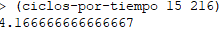

**Bug N° 1: Retorno de números decimales (flotantes) en divisiones temporales**

* **Contexto:** Al desarrollar la función `ciclos-por-tiempo` (Requerimiento 5).
* **Problema encontrado:** Al ejecutar la división para calcular cuántos ciclos entran en 15 minutos (900 segundos) divididos por la duración de un ciclo (216 segundos), el intérprete Lisp devolvió el número decimal `4.166666666666667`. Esto rompía la lógica del sistema, ya que requeríamos obtener exclusivamente la cantidad de *ciclos completos* (un número entero exacto, es decir, 4).

  
* **Causa conceptual:** La función de división primitiva `/` realiza cálculos exactos. En este entorno de ejecución, al dividir esos enteros, el resultado se representó como un número de coma flotante para no perder los restos (indicando que entran 4 ciclos y un "pedazo" del quinto).
* **Solución aplicada:** Se envolvió la operación aritmética completa con la primitiva `(floor ...)`. Esta función procesa cualquier número real y lo trunca hacia el entero inferior más cercano. De esta manera, LISP procesa el `4.1666...`, descarta los decimales (el ciclo incompleto) y devuelve el valor entero `4`, manteniendo la pureza de la función y evitando errores de tipado. *(Se adjunta captura de pantalla en consola demostrando el retorno decimal original).*

**Aclaracion de la aparicion carpeta /image** -> Para poder importar imagenes a un .md necesito que este el .png en los archivos locales del .md asi que cree la carpeta /image
